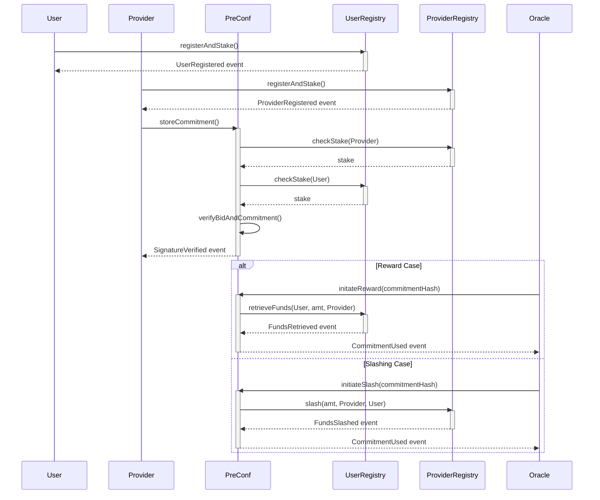

# Pre-Confirmation Rollup Contracts

## Overview

This repository contains Solidity contracts and tests for handling pre-confirmation commitments and bids. The system uses two separate registries to manage users and providers, where both parties must stake ETH to participate. Commitments are verified and stored in a contract.

## Contracts

### PreConfCommitmentStore

This is the core contract that handles pre-confirmation commitments. It uses EIP-712 for typed data hashing and signing. Commitments are stored in a mapping, accessible via their hash.

#### Functions

- `getBidHash`: Generates a hash of the bid based on the transaction hash, bid amount, and block number.
- `getPreConfHash`: Generates a hash of the pre-confirmation commitment.
- `recoverAddress`: Recovers the signer's address from a message digest and a signature.
- `verifyBid`: Verifies a bid's validity by checking the signer's stake and the bid amount.
- `storeCommitment`: Stores a valid commitment in the contract.
-

### IUserRegistry

This is an interface that must be implemented by the user registry contract. It contains methods for registering, staking, and retrieving funds.

#### Functions

- `registerAndStake`: Registers a user and stakes ETH.
- `checkStake`: Checks the staked amount for a given user.
- `depositFunds`: Deposits additional funds into the contract.
- `retrieveFunds`: Retrieves a specific amount of funds for a user and sends them to a provider.

### IProviderRegistry

This is an interface that must be implemented by the provider registry contract. It contains methods for registering, depositing funds, slashing, and rewarding.

#### Functions

- `registerAndStake`: Registers a provider and stakes ETH.
- `checkStake`: Checks the staked amount for a given provider.
- `depositFunds`: Deposits additional funds into the contract.
- `slash`: Slashes a specific amount of staked ETH from a provider and sends it to a user.
- `reward`: Rewards a specific amount of ETH to a provider.

Note: In both IProviderRegistry and IUserRegistry - some functions are restrictied to be called exclusively by the preconfimration contract.

## Tests

The tests in this repository perform the following:

- Deployment of the `ProviderRegistry` and `UserRegistry` contracts.
- Registration and staking of users and providers.
- Verification of bid hashes and pre-confirmation commitment hashes.
- Recovery of signer addresses.
- Storage of valid commitments.

To run the tests, use the following command:

```bash
npx hardhat test
```

## Flow of Actors



#### Deploy Scripts using hardhat

```
npx hardhat run scripts/deploy.js
```

#### Deploy Scripts using forge

- Install foundryup

```
curl -L https://foundry.paradigm.xyz | bash
```

- Running foundryup by itself will install the latest (nightly) precompiled binaries: forge, cast, anvil and chisel
```
foundryup
```

- Setup ENV Vars

```
export RPC_URL="http://localhost:8545/"
export PRIVATE_KEY="your-private-key"
export CHAIN_ID=17864
```

- Run the deploy script

```
forge script scripts/DeployScript.s.sol:DeployScript --rpc-url $RPC_URL --private-key $PRIVATE_KEY --broadcast --chain-id $CHAIN_ID -vvvv

```


#### Test Contracts

```
forge test
```

#### Check Coverage

```
forge coverage
```

## Local Contract Deployment with Anvil

### Prerequisites
Ensure Foundry is installed with Anvil, Cast, and Forge.

### Steps

1. **Start Anvil**:
    Open a terminal and run Anvil to initiate a local Ethereum network simulation:

    ```bash
    anvil
    ```

    Anvil will start and display a list of available accounts and their corresponding private keys, pre-funded with Ethereum for testing purposes.

2. **Note the Private Keys**:
    Anvil provides a set of accounts with their private keys. Example output:

    ```
    Available Accounts
    ==================

    (0) "0xf39Fd6e51aad88F6F4ce6aB8827279cffFb92266" (10000 ETH)
    (1) "0x70997970C51812dc3A010C7d01b50e0d17dc79C8" (10000 ETH)
    ... (more accounts) ...

    Private Keys
    ==================

    (0) 0xac0974bec39a17e36ba4a6b4d238ff944bacb478cbed5efcae784d7bf4f2ff80
    (1) 0x59c6995e998f97a5a0044966f0945389dc9e86dae88c7a8412f4603b6b78690d
    ... (more keys) ...
    ```

3. **Deploy Your Contract**:
    Use one of the provided private keys to deploy your contract using Forge. Example command:

    ```bash
    forge create PreConfCommitmentStore --private-key 0xac0974bec39a17e36ba4a6b4d238ff944bacb478cbed5efcae784d7bf4f2ff80 --constructor-args 0xD7a4B4cbA2DAb2dc3E2FCa91ea903Bf49842FD87 0xD7a4B4cbA2DAb2dc3E2FCa91ea903Bf49842FD87 0xD7a4B4cbA2DAb2dc3E2FCa91ea903Bf49842FD87
    ```

    After executing the command, you should see an output similar to the following:

    ```
    eth_getBlockByNumber
    eth_feeHistory
    eth_sendRawTransaction

        Transaction: 0x0229f1adf045bfcc554f0ecff57d5a6cff05aecf222479a1a568ac840386dfff
        Contract created: 0x5fbdb2315678afecb367f032d93f642f64180aa3
        Gas used: 2733597
    ```
