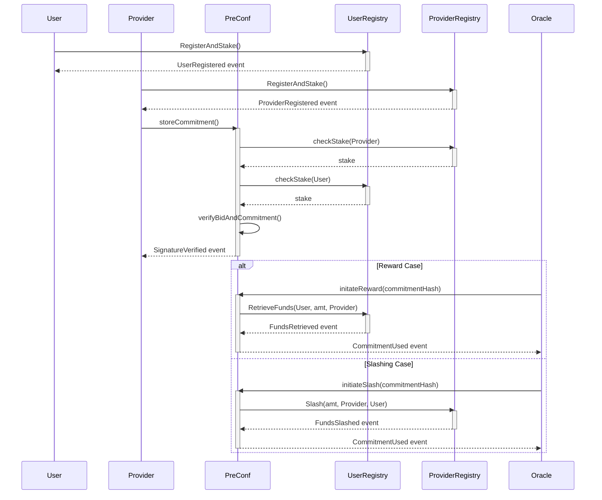

# Pre-Confirmation Rollup Contracts

## Overview

This repository contains Solidity contracts and tests for handling pre-confirmation commitments and bids. The system uses two separate registries to manage users and providers, where both parties must stake ETH to participate. Commitments are verified and stored in a contract.

## Contracts

### PreConfCommitmentStore

This is the core contract that handles pre-confirmation commitments. It uses EIP-712 for typed data hashing and signing. Commitments are stored in a mapping, accessible via their hash.

#### Functions

- `getBidHash`: Generates a hash of the bid based on the transaction hash, bid amount, and block number.
- `getPreConfHash`: Generates a hash of the pre-confirmation commitment.
- `recoverAddress`: Recovers the signer's address from a message digest and a signature.
- `verifyBid`: Verifies a bid's validity by checking the signer's stake and the bid amount.
- `storeCommitment`: Stores a valid commitment in the contract.

### IUserRegistry

This is an interface that must be implemented by the user registry contract. It contains methods for registering and staking users.

#### Functions

- `RegisterAndStake`: Registers a user and stakes ETH.
- `checkStake`: Checks the staked amount for a given user.

### IProviderRegistry

This is an interface that must be implemented by the provider registry contract. It contains methods for registering and staking providers.

#### Functions

- `RegisterAndStake`: Registers a provider and stakes ETH.
- `checkStake`: Checks the staked amount for a given provider.

## Tests

The tests in this repository perform the following:

- Deployment of the `ProviderRegistry` and `UserRegistry` contracts.
- Registration and staking of users and providers.
- Verification of bid hashes and pre-confirmation commitment hashes.
- Recovery of signer addresses.
- Storage of valid commitments.

To run the tests, use the following command:

```bash
npx hardhat test
```


## Flow of Actors

